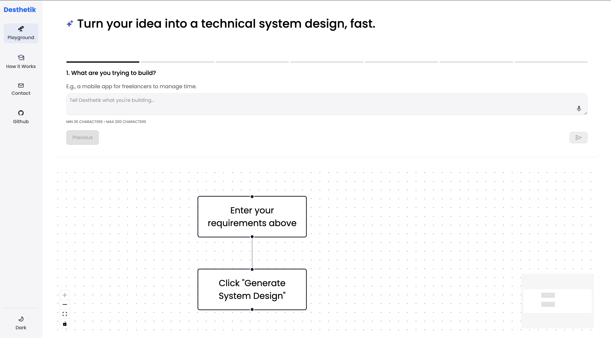

# Idea to world-class system design in seconds, not weeks.

Desthetik is an open-source system design agent.

## The Problem

People often talk about democratizing access to code and software development. And while it's true that more people can now build software—thanks to AI tools and low-code platforms—not everyone can build a successful company. The real differentiator in the next generation of startups won't be access to code; it'll be system design and user experience (UX).

AI tools like Cursor, Copilot, or even ChatGPT can write code once you know what to build, but they don't know why to build something a certain way. They lack contextual intuition — that sense of how design choices interact with the actual problem domain.

Most people don't have the human-level intuition necessary to translate an abstract idea into a well-designed, usable product that aligns with real-world user needs. You can tell an AI, "I want to build a productivity app," and it may generate code for one. But that doesn't mean the resulting app will be useful, usable, or desirable. The effectiveness of a product often lies in how it's designed, not just what it is.

Many non-technical founders either spend too much time trying to figure out how to build their product—or worse, they skip that phase entirely because it feels ambiguous or overwhelming. There's often a lack of structured thinking about system components, user interactions, and overall architecture. And that's a core problem.

## The Solution

Desthetik combines a multi-turn input flow—like a conversational form—with backend logic that turns structured responses into flowchart-like visual diagrams. The system dynamically chooses a graph structure based on the user's context (e.g., experience level, goal, etc.), with predefined graph "types" that map user inputs to the right visualization.

<p align="center">
  
  <br />
  <em>Natural language --> System design with full control </em>
</p>

### Technical Implementation

The stack includes:
- Frontend: React/Next.js with a visual layout library (React Flow or custom Figma-like canvas)
- Backend: Handles prompt generation and LLM interaction
- Process:
  1. Take structured user inputs
  2. Convert into composite prompt
  3. Process through LLM
  4. Parse structured output
  5. Match to graph template
  6. Convert nodes into interactive cards

The interface uses Figma-style draggable cards for the frontend, keeping it visual and editable for iteration and clarity. This approach is significantly more intuitive than static graph outputs.

## Development Focus

The initial MVP focuses on making one or two graph types to start off with.

## Getting Started

### Prerequisites
- Node.js (v16 or higher)
- npm or yarn
- Python 3.8+ (for backend)

### Installation

1. Clone the repository:
```bash
git clone https://github.com/Three7vn/desthetik.git
cd desthetik
```

2. Install frontend dependencies:
```bash
npm install
```

3. Install backend dependencies:
```bash
pip install -r requirements.txt
```

### Running the Application

#### Frontend
Start the Next.js development server:
```bash
npm run dev
```
This will run the application on [http://localhost:3000](http://localhost:3000)

#### Backend
Start the FastAPI server:
```bash
cd backend
uvicorn main:app --reload
```
The API will be available at [http://localhost:8000](http://localhost:8000)

### Development Notes
- The frontend uses TypeScript and Next.js
- @xyflow/react (React Flow) is used for the flowchart visualization
- The backend uses FastAPI and will connect to an LLM for generating system designs


### Contact
— Abraham (Avram) Dada: abraham@stoado.com
